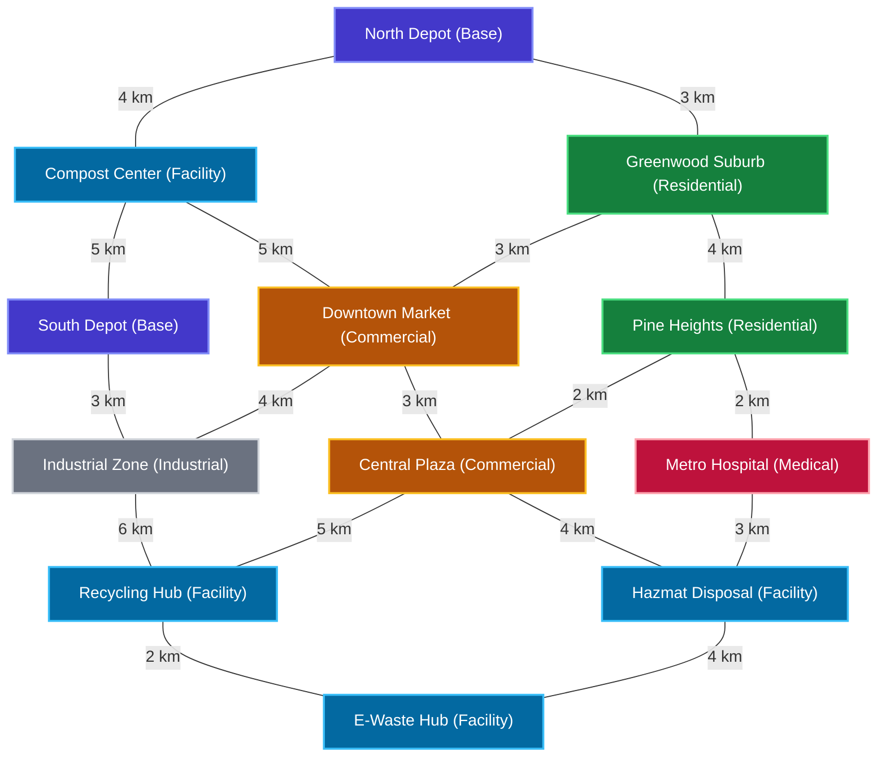

# WasteWise City Network Map

This document presents a high-fidelity visual map of the **WasteWise Smart Urban Collection Network**. It illustrates depots, waste generation zones (residential, commercial, industrial, and medical), and specialized processing facilities with accurate travel distances.

---

## Interactive City Topology Map

---

## Location Properties Summary

### Depots & Bases
*   **North Depot**: Home depot for compactors `V001`, `V002`, and mini-truck `V005`.
*   **South Depot**: Home depot for hazmat truck `V003` and electronic e-waste carrier `V004`.

### Waste Generation Zones
*   **Greenwood Suburb & Pine Heights**: Residential area generating Biodegradable, Recyclable, and Hazardous waste.
*   **Metro Hospital**: Hospital zone generating Hazardous and Biodegradable waste.
*   **Downtown Market & Central Plaza**: Commercial centers generating Recyclable, Electronic, and Biodegradable waste.
*   **Industrial Zone**: Industrial area generating Hazardous and Electronic waste.

### Processing Facilities
*   **Compost Center (`F001`)**: Processes biodegradable materials (capacity: 1000 kg).
*   **Recycling Hub (`F002`)**: Processes recyclables (capacity: 1500 kg).
*   **Hazmat Disposal (`F003`)**: Sanitizes and processes hazardous elements (capacity: 500 kg).
*   **E-Waste Hub (`F004`)**: Recycles electronic materials (capacity: 300 kg).
